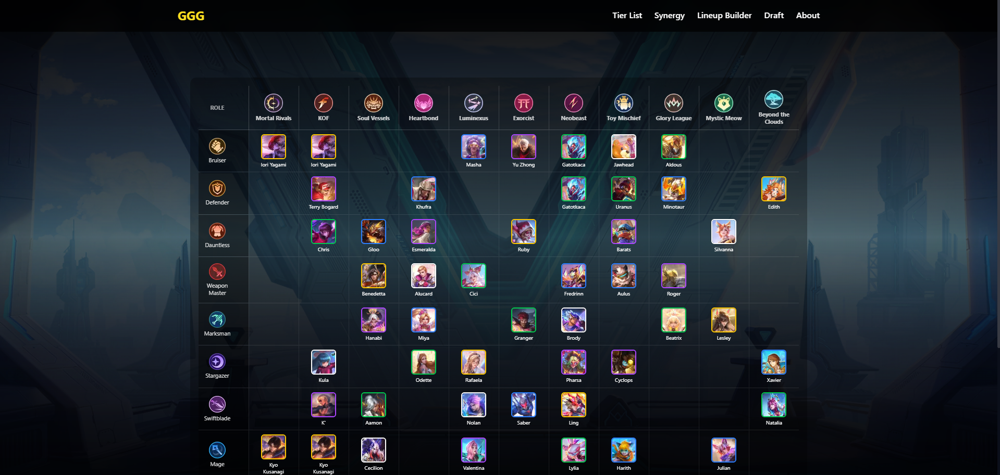

# 🪄 Magic Chess GoGo (MCGG)

Magic Chess GoGo (MCGG) is a community-driven website that provides **clear, visual, and beginner-friendly guides** for _Magic Chess_, with a strong focus on **4v4 mode** and global players.

Instead of duplicating in-game data, MCGG emphasizes **strategy, composition roles, and practical decision-making**.

---

## 🌐 Live Website

https://mcgg-khoceng.vercel.app

---

## 🖼️ Website Preview

### 🏠 Homepage

### 🧩 Lineup Recommendation

### 🔗 Synergy Overview

### 📊 Tier List

---

## ✨ Key Features

- 🌍 Global-oriented content (English)
- 📘 Beginner-friendly **4v4 & Solo guides**
- 🧩 Curated synergy compositions (not full data dump)
- 🧠 Clear role separation: **Support & Carry**
- 🎨 Visual-first guide layout
- ⚡ Easy to update for future patches

-
